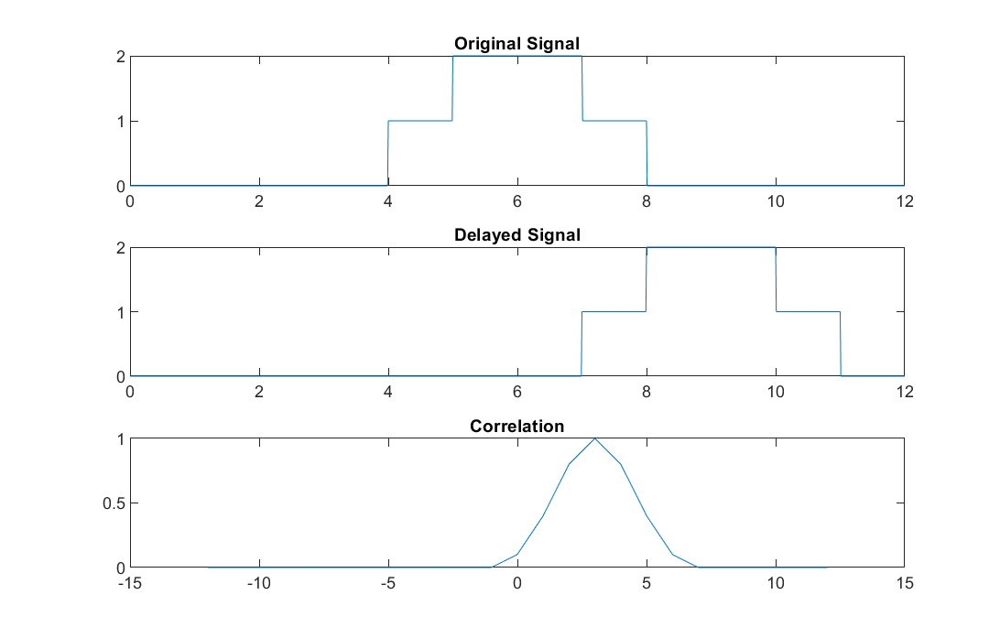

### **Experiment No:** 04
### **Experiment Name:** Determining Delay between Two Signals using Cross Correlation  

### **Theory:**

<p align='justify'>
Correlation is an operation used in many applications in digital signal processing. It is a measure of the degree to which two sequences are similar.Depending on whether the signals considered for correlation are same or different, we have two kinds of correlation: (i) Auto-Correlation, (ii) Cross-Correlation.
</p>
<p align='justify'>
In signal processing, cross-correlation is a measure of similarity of two signals relative to one another. This is very useful to determine the delay between two signals. Delay between two signals can be found out by determining the time instant during which both of the signals match with each other the best.
</p>
<br>

### **Code:**

```matlab
t=0:0.01:12;

x1= t>=4 & t<=8;
x2= t>=5 & t<=7;
s1=x1+x2;

y1= t>=7 & t<=11;
y2= t>=8 & t<=10;
s2=y1+y2;

[c,lag]=xcorr(s2,s1);
c1=c/max(abs(c(:)));

subplot(3,1,1)
plot(t,s1);
title('Original Signal');

subplot(3,1,2)
plot(t,s2);
title('Delayed Signal');

subplot(3,1,3)
plot(lag*0.01,c1);
title('Correlation');

maxY = max(c1);
indexesOfMax = find(c1 == maxY);
p = lag(indexesOfMax);
q=p*0.01;
disp("Delay: ");
disp(q);
```

### **Output:**




<br>

### **Discussion and Conclusion:**
<p align='justify'>
In this experiment an original signal and a delayed version of that signal were taken. Then the cross correlation of those signals were determined to find out the delay between two signals.
</p>